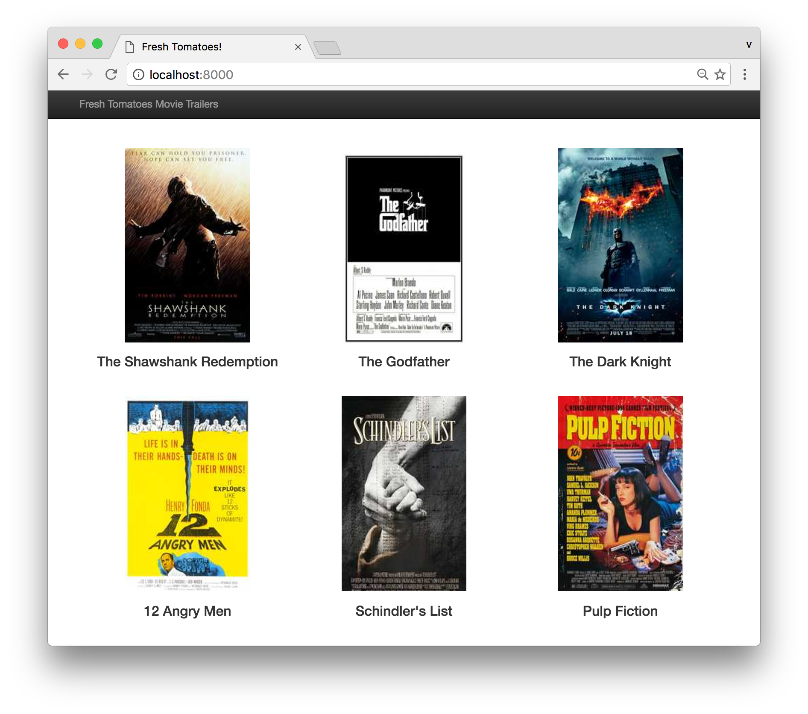

# Fresh Tomatoes

Its like Rotten Tomatoes, but only trailers and fresh.

## Instructions

1. Install the requirements:
        
        pip install -r requirements.txt

2. Generate the output/index file:

        python main.py

3. Serve the current directory and access it at `http://localhost:8000`

        python -m http.server

4. Access the API at `http://localhost:8000/api.json`

## Screenshot

## License

MIT. Check `LICENSE`.